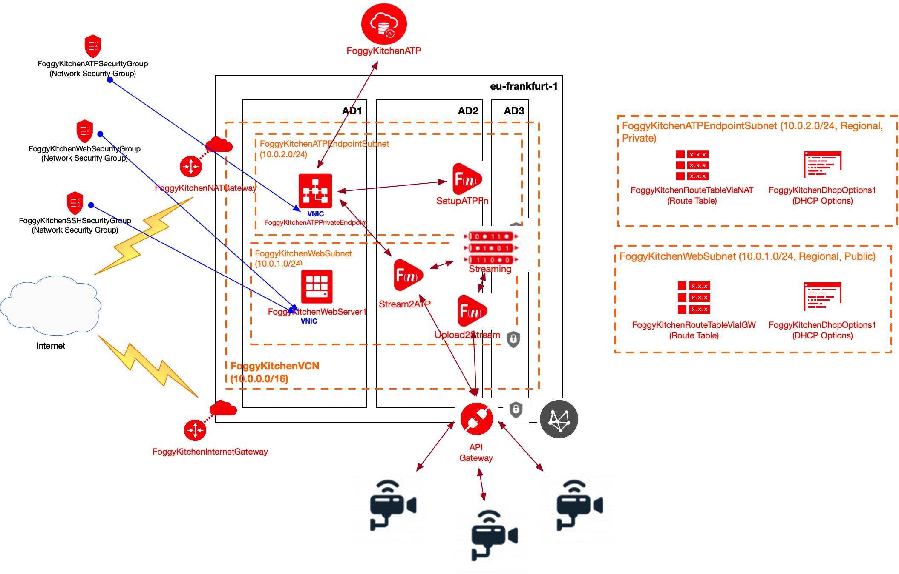
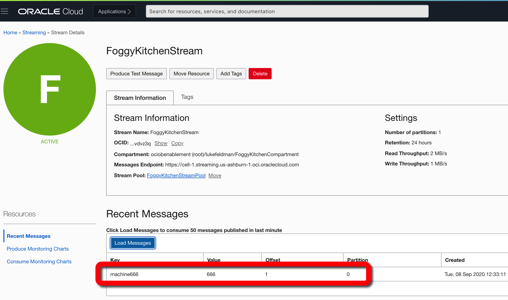

# Terraform OCI Streaming

## Project description

In this repository I have documented my hands-on experience with Terrafrom for the purpose of OCI Streaming deployment. This set of HCL based Terraform files can customized according to any requirements.  

## Topology Diagram 

With the usage of this example HCL code you can build topology documented by diagram below. This topology is extremly simplified for education purposes and rather cannot be used for the production implementations. In this configuration 3 functions are deployed:
1. SetupATPFn - for the purpose of creating IoT_DATA table created within OCI ATP instance, 
2. Upload2StreamFn - for the purpose of uploading messages to the OCI Streaming Service, 
3. Stream2ATPFn - for the purpose of on demand message transfers from the OCI Streaming Service to OCI ATP instance.

Functions Upload2StreamFn and Stream2ATPFin will exposed to the public Internet via OCI API Gateway (accesible via POST and GET methods). This automated deployment will also include small compute instance with Flask-based webserver. Current content of ATP's IoT_DATA table will be exposed in a form of the webpage presented from Flask. Additionally this Flask application will have capability to run refresh transfers from OCI Streaming Service to ATP instance (button for invoking Stream2ATPFn function).



## How to use code 

### STEP 1.

Clone the repo from GitHub by executing the command as follows and then go to terraform-oci-streaming directory:

```
[opc@terraform-server ~]$ git clone https://github.com/mlinxfeld/terraform-oci-streaming.git
Cloning into 'terraform-oci-streaming'...
remote: Enumerating objects: 45, done.
remote: Counting objects: 100% (45/45), done.
remote: Compressing objects: 100% (31/31), done.
remote: Total 45 (delta 19), reused 40 (delta 14), pack-reused 0
Unpacking objects: 100% (45/45), done.

[opc@terraform-server ~]$ cd terraform-oci-streaming/

[opc@terraform-server terraform-oci-streaming]$ ls -latr
total 1512
-rw-r--r--   1 opc opc     228 22 cze 15:17 provider.tf
-rw-r--r--   1 opc opc     184 22 cze 19:00 compartment.tf
-rw-r--r--   1 opc opc     442 22 cze 19:01 dhcp_options.tf
-rw-r--r--   1 opc opc     491 22 cze 19:01 subnet_web.tf
-rw-r--r--   1 opc opc     713 22 cze 19:01 security_list.tf
-rw-r--r--   1 opc opc     422 22 cze 19:01 route2.tf
-rw-r--r--   1 opc opc     431 22 cze 19:01 route1.tf
-rw-r--r--   1 opc opc     250 22 cze 19:01 internet_gateway.tf
-rw-r--r--   1 opc opc     235 22 cze 19:18 natgateway.tf
-rw-r--r--   1 opc opc     499 22 cze 19:26 streaming.tf
-rw-r--r--   1 opc opc     468 23 cze 15:18 subnet_atp_endpoint.tf
-rw-r--r--   1 opc opc    1187 23 cze 15:19 atp.tf
-rw-r--r--   1 opc opc     579 23 cze 15:19 atp_wallet.tf
-rw-r--r--   1 opc opc     147 23 cze 16:02 sqlnet.ora
-rw-r--r--   1 opc opc     513 23 cze 17:00 vcn.tf
-rw-r--r--   1 opc opc    2218 23 cze 17:13 variables.tf
-rw-r--r--   1 opc opc    2751 24 cze 13:21 security_group_rule.tf
-rwxr-xr-x   1 opc opc    1434 24 cze 13:32 webserver1.tf
-rw-r--r--   1 opc opc     775 24 cze 13:33 security_group.tf
-rw-r--r--   1 opc opc    3127 25 cze 11:34 policies.tf
drwxr-xr-x  12 opc opc     384 25 cze 11:56 .git
drwxr-xr-x   3 opc opc      96 25 cze 14:11 .terraform
drwxr-xr-x   5 opc opc     160 25 cze 14:19 functions
-rw-r--r--   1 opc opc    1342 25 cze 15:04 api_gateway.tf
-rw-r--r--   1 opc opc    2002 25 cze 15:56 functions.tf
drwxr-xr-x   5 opc opc     160 25 cze 21:25 flask
-rw-r--r--   1 opc opc    5118 26 cze 10:21 fn_setup.tf
-rw-r--r--   1 opc opc    5666 26 cze 11:29 config_mgmt_on_webserver1.tf
drwxr-xr-x  54 opc opc    1728 25 sie 11:02 ..
-rw-r--r--@  1 opc opc  499168  3 wrz 15:47 terraform-oci-streaming.png
drwxr-xr-x  34 opc opc    1088  3 wrz 15:47 .
-rw-r--r--@  1 opc opc   11634  3 wrz 15:52 README.md

```

### STEP 2.

Within web browser go to URL: https://www.terraform.io/downloads.html. Find your platform and download the latest version of your terraform runtime. Add directory of terraform binary into PATH and check terraform version:

```
[opc@terraform-server terraform-oci-streaming]$ export PATH=$PATH:/home/opc/terraform

[opc@terraform-server terraform-oci-streaming]$ terraform --version

Your version of Terraform is out of date! The latest version
is 0.13.2. You can update by downloading from https://www.terraform.io/downloads.html

Terraform v0.13.0
```

### STEP 2a.

If you are not using OCI Cloud Shell you need to install Docker Engine on your terraform server (required for docker login/build/push commands embeded in Terraform HCL code):

```

[opc@terraform-server terraform-oci-streaming]$ sudo su -

[root@terraform-server terraform-oci-streaming]$ yum update

[root@terraform-server terraform-oci-streaming]$ yum install yum-utils

[root@terraform-server terraform-oci-streaming]$ yum-config-manager --enable *addons

[root@terraform-server terraform-oci-streaming]$ yum install docker-engine

[root@terraform-server terraform-oci-streaming]$ groupadd docker

[root@terraform-server terraform-oci-streaming]$ service docker restart

[root@terraform-server terraform-oci-streaming]$ usermod -a -G docker opc

[root@terraform-server terraform-oci-streaming]$ exit

[opc@terraform-server terraform-oci-streaming]$ exit

```

### STEP 2b.

If you are not using OCI Cloud Shell you need to install fnProject on your terraform server (required for fn build command embeded in Terraform HCL code):

```
[opc@terraform-server ~]# curl -LSs https://raw.githubusercontent.com/fnproject/cli/master/install | sh
fn version 0.5.97

        ______
       / ____/___
      / /_  / __ \
     / __/ / / / /
    /_/   /_/ /_/`

```

### STEP 3. 
Next create environment file with TF_VARs:

```
[opc@terraform-server terraform-oci-streaming]$ vi setup_oci_tf_vars.sh
export TF_VAR_user_ocid="ocid1.user.oc1..aaaaaaaaob4qbf2(...)uunizjie4his4vgh3jx5jxa"
export TF_VAR_tenancy_ocid="ocid1.tenancy.oc1..aaaaaaaas(...)krj2s3gdbz7d2heqzzxn7pe64ksbia"
export TF_VAR_compartment_ocid="ocid1.compartment.oc1..aaaaaaaacnmuyhg2mpb3z(...)nai3jk5qaoieg3ztinqhamalealq"
export TF_VAR_fingerprint="00:f9:d1:41:bb:57(...)82:47:e6:00"
export TF_VAR_private_key_path="/tmp/oci_api_key.pem"
export TF_VAR_region="eu-frankfurt-1"

export TF_VAR_atp_password="BEstrO0ng_#11"
export TF_VAR_atp_admin_password="BEstrO0ng_#11"
export TF_VAR_ocir_repo_name="functions"
export TF_VAR_ocir_user_name="martin.linxfeld@foggykitchen.com"
export TF_VAR_ocir_namespace="foggykitchen"
export TF_VAR_ocir_docker_repository="fra.ocir.io"
export TF_VAR_ocir_user_password="HsX]Ea(...):z4dgj2"

[opc@terraform-server terraform-microservice]$ source setup_oci_tf_vars.sh
```

### STEP 4.
Run *terraform init* with upgrade option just to download the lastest neccesary providers:

```
[opc@terraform-server terraform-oci-streaming]$ terraform init -upgrade

Initializing the backend...

Initializing provider plugins...
- Finding hashicorp/oci versions matching "3.76.0"...
- Finding latest version of hashicorp/null...
- Finding latest version of hashicorp/random...
- Finding latest version of hashicorp/local...
- Installing hashicorp/oci v3.76.0...
- Installed hashicorp/oci v3.76.0 (signed by HashiCorp)
- Installing hashicorp/null v2.1.2...
- Installed hashicorp/null v2.1.2 (signed by HashiCorp)
- Installing hashicorp/random v2.3.0...
- Installed hashicorp/random v2.3.0 (signed by HashiCorp)
- Installing hashicorp/local v1.4.0...
- Installed hashicorp/local v1.4.0 (signed by HashiCorp)

The following providers do not have any version constraints in configuration,
so the latest version was installed.

To prevent automatic upgrades to new major versions that may contain breaking
changes, we recommend adding version constraints in a required_providers block
in your configuration, with the constraint strings suggested below.

* hashicorp/local: version = "~> 1.4.0"
* hashicorp/null: version = "~> 2.1.2"
* hashicorp/random: version = "~> 2.3.0"

Terraform has been successfully initialized!

You may now begin working with Terraform. Try running "terraform plan" to see
any changes that are required for your infrastructure. All Terraform commands
should now work.

If you ever set or change modules or backend configuration for Terraform,
rerun this command to reinitialize your working directory. If you forget, other
commands will detect it and remind you to do so if necessary.
```

### STEP 5.
Run *terraform apply* to provision the content of this code (type **yes** to confirm the the apply phase):

```
[opc@terraform-server terraform-oci-streaming]$ terraform apply 

terraform apply
data.oci_identity_availability_domains.ADs: Refreshing state...
data.oci_core_images.OSImageLocal: Refreshing state...

An execution plan has been generated and is shown below.
Resource actions are indicated with the following symbols:
  + create
 <= read (data resources)

Terraform will perform the following actions:

  # data.oci_apigateway_deployment.FoggyKitchenAPIGatewayDeployment will be read during apply
  # (config refers to values not yet known)
 <= data "oci_apigateway_deployment" "FoggyKitchenAPIGatewayDeployment"  {

(...)

  # random_string.wallet_password will be created
  + resource "random_string" "wallet_password" {
      + id          = (known after apply)
      + length      = 16
      + lower       = true
      + min_lower   = 0
      + min_numeric = 0
      + min_special = 0
      + min_upper   = 0
      + number      = true
      + result      = (known after apply)
      + special     = true
      + upper       = true
    }

Plan: 50 to add, 0 to change, 0 to destroy.

(...)

null_resource.FoggyKitchenWebserver1_Flask_WebServer_and_access_ATP: Provisioning with 'remote-exec'...
null_resource.FoggyKitchenWebserver1_Flask_WebServer_and_access_ATP (remote-exec): Connecting to remote host via SSH...
null_resource.FoggyKitchenWebserver1_Flask_WebServer_and_access_ATP (remote-exec):   Host: 129.213.114.76
null_resource.FoggyKitchenWebserver1_Flask_WebServer_and_access_ATP (remote-exec):   User: opc
null_resource.FoggyKitchenWebserver1_Flask_WebServer_and_access_ATP (remote-exec):   Password: false
null_resource.FoggyKitchenWebserver1_Flask_WebServer_and_access_ATP (remote-exec):   Private key: true
null_resource.FoggyKitchenWebserver1_Flask_WebServer_and_access_ATP (remote-exec):   Certificate: false
null_resource.FoggyKitchenWebserver1_Flask_WebServer_and_access_ATP (remote-exec):   SSH Agent: false
null_resource.FoggyKitchenWebserver1_Flask_WebServer_and_access_ATP (remote-exec):   Checking Host Key: false
null_resource.FoggyKitchenWebserver1_Flask_WebServer_and_access_ATP (remote-exec): Connected!
null_resource.FoggyKitchenWebserver1_Flask_WebServer_and_access_ATP (remote-exec): == 6. Run Flask with ATP access
null_resource.FoggyKitchenWebserver1_Flask_WebServer_and_access_ATP (remote-exec): Python 3.6.8
null_resource.FoggyKitchenWebserver1_Flask_WebServer_and_access_ATP (remote-exec): nohup: appending output to ‘nohup.out’
null_resource.FoggyKitchenWebserver1_Flask_WebServer_and_access_ATP (remote-exec): root     11955 11895  0 12:25 pts/0    00:00:00 sudo -u root nohup /tmp/flask_atp.sh
null_resource.FoggyKitchenWebserver1_Flask_WebServer_and_access_ATP (remote-exec): root     11958 11955  0 12:25 pts/0    00:00:00 /bin/bash /tmp/flask_atp.sh
null_resource.FoggyKitchenWebserver1_Flask_WebServer_and_access_ATP (remote-exec): root     11959 11958  4 12:25 pts/0    00:00:00 python3 /tmp/flask_atp.py
null_resource.FoggyKitchenWebserver1_Flask_WebServer_and_access_ATP (remote-exec): root     11961 11959  5 12:25 pts/0    00:00:00 /bin/python3 /tmp/flask_atp.py
null_resource.FoggyKitchenWebserver1_Flask_WebServer_and_access_ATP (remote-exec): opc      11965 11895  0 12:25 pts/0    00:00:00 grep flask
null_resource.FoggyKitchenWebserver1_Flask_WebServer_and_access_ATP: Still creating... [10s elapsed]
null_resource.FoggyKitchenWebserver1_Flask_WebServer_and_access_ATP: Creation complete after 10s [id=8618060339451043606]

Apply complete! Resources: 47 added, 0 changed, 0 destroyed.

Outputs:

FoggyKitchen_Flask_Webserver1_URL = [
  "http://192.213.114.76/",
]
FoggyKitchen_Upload2StreamFn_POST_EndPoint_URL = [
  "https://kminml4nndeebhw43nb425vlrq.apigateway.us-ashburn-1.oci.customer-oci.com/v1/upload2stream",
]

(...)

```

### STEP 6.
First verify that ATP has some initial dummy data by accessing Flask Webserver URL. The initial page should look like this (includes 3 records for IoT machines1 up to machine3):


Now it is time to upload new records to Streaming via API Gateway and Upload2StreamFn function behind the scence.
I am using Postman to upload new messages. I have done it few times (machine555 and machine666). Here is the screen from the machine555 upload:


Now you can verify the messages in the OCI Streaming:



Ultimatelly we should transfer messages from OCI Streaming to ATP by clicking in Flask on the button (stream2atp):


After page refresh you should discover that ATP IoT table has been updated with machine555 and machine666 data:


### STEP 7.
After testing the environment you can remove the whole OCI infra. You should just run *terraform destroy* (type **yes** for confirmation of the destroy phase):

```
[opc@terraform-server terraform-oci-microservice]$ terraform destroy -auto-approve
random_string.wallet_password: Refreshing state... [id=&Fj<5i-nCY9#a_YF]
data.oci_core_images.OSImageLocal: Refreshing state... [id=2020-09-07 13:52:34.955803 +0000 UTC]
data.oci_identity_availability_domains.ADs: Refreshing state... [id=2020-09-07 13:52:35.000553 +0000 UTC]
oci_identity_compartment.FoggyKitchenCompartment: Refreshing state... [id=ocid1.compartment.oc1..aaaaaaaayxvhhjidfxsq35muvshgxv62ac2mn6mi2yo2xqzsq53jgkuozfwq]
oci_identity_policy.FoggyKitchenFunctionsServiceReposAccessPolicy: Refreshing state... [id=ocid1.policy.oc1..aaaaaaaa4hlegmhl5qgy44bypea67isqaslllyaqdj4ul3urpu2x5hscw5qa]

(...)

oci_identity_compartment.FoggyKitchenCompartment: Destroying... [id=ocid1.compartment.oc1..aaaaaaaayxvhhjidfxsq35muvshgxv62ac2mn6mi2yo2xqzsq53jgkuozfwq]
oci_identity_compartment.FoggyKitchenCompartment: Destruction complete after 0s

Destroy complete! Resources: 50 destroyed.
```
